# Chatting Room

## Explanation
多人聊天室，可以讓多個clients 互相傳遞訊息，
如 client A B C 連到 server ， client A 傳一封訊息出去給 server ，server 接收後會 broadcast 給 client B C。如果打 「 send [filename]」，就會把這個file 傳出去給 server

## Use
登入 client
```
python3 client.py 192.168.0.128 7851
```

登入 server
```
python3 chat_server.py 192.168.0.128 8080
```

## 流程
Server 登入
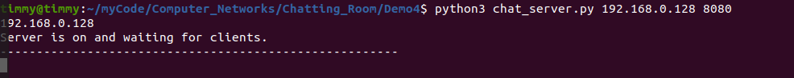

兩個 Clients 登入（192.168.0.129 和 192.168.0.103）

Client A (192.168.0.129)
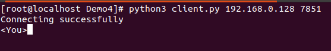

Client B (192.168.0.103)
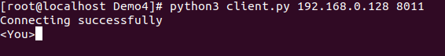

Server 顯示兩個 Clients 成功連線
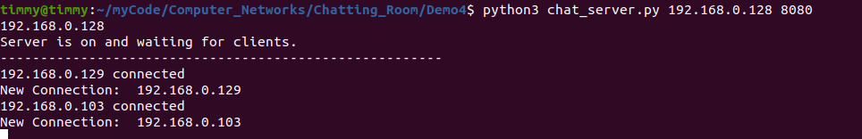

Client A (192.168.0.129) 輸入 Hello
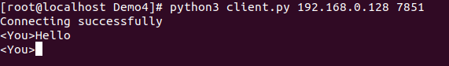

Server 有收到，並 broadcast 給 Client B(192.168.0.103)
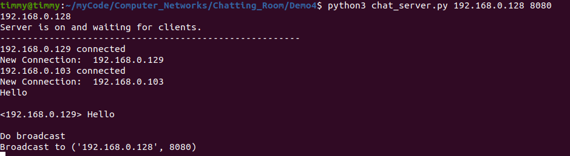

Client B (192.168.0.103) 成功收到
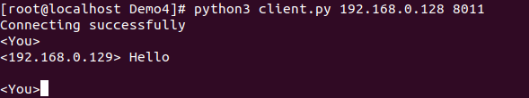

Client B (192.168.0.103) 傳送 file
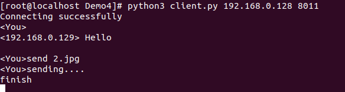

Server 成功收到
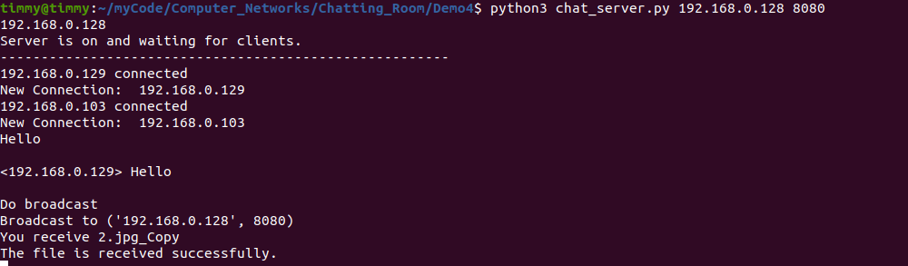

Client B (192.168.0.103) 輸入 leave 離開連線
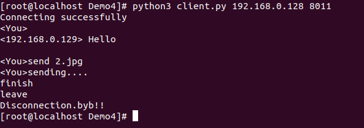

Server 也知道Client B (192.168.0.103) 離開連線
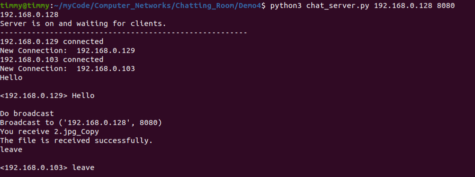